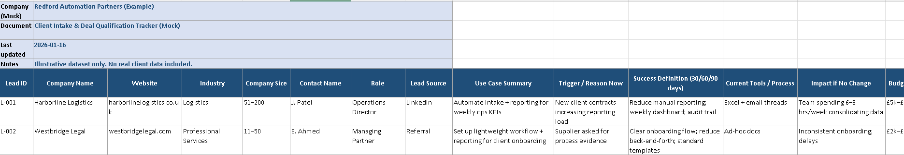
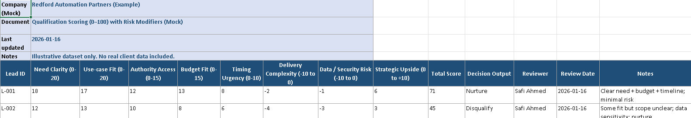

---

## Client Intake & Deal Qualification System (Mock)

A structured client intake and deal qualification system designed for a small automation consultancy to assess inbound leads, prioritise opportunities, and reduce time spent on low-quality prospects.

The system:
- Captures structured lead intake data across company, use case, and trigger context
- Assesses commercial fit using weighted scoring and risk modifiers
- Supports consistent go / nurture / disqualify decisions
- Creates a repeatable qualification process independent of individual judgement

### Client Intake Tracker – Overview (Mock)

High-level view of inbound leads, including company context, use case summary, trigger for engagement, current process, and expected impact if no change is made.

*This view enables quick assessment of lead context and surfaces operational pain points before moving into qualification.*

### Qualification Scoring & Decision Model (Mock)

A weighted scoring model used to assess deal viability based on need clarity, use-case fit, authority access, budget, urgency, delivery complexity, and data risk.

*This model supports objective prioritisation and reduces time spent on low-probability opportunities while preserving higher-upside leads for nurturing.*
